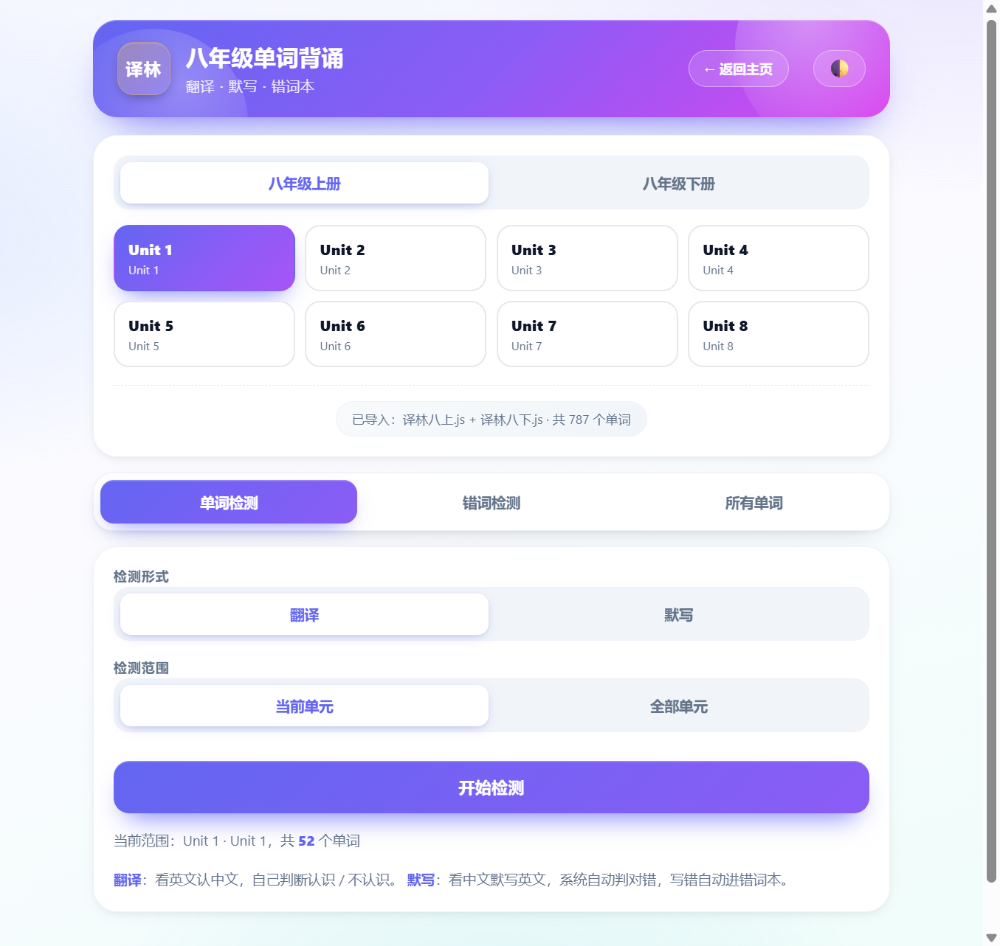

# ADELAROL · 英语学习中心

> 纯浏览器本地的英语学习工具集，覆盖雅思备考与课堂同步词汇，所有学习数据自动保存在本地浏览器，开箱即用、零依赖、零账号。

[在线体验](https://adelarol.github.io/learn-English/) · [项目主页](./index.html)

---

## 项目简介

ADELAROL 英语学习中心是一个面向个人备考场景的轻量级英语学习网站，目标是用最简单的方式把「背单词 + 听力刷题 + 错题巩固」串成一条完整的学习闭环。

- **本地优先**：所有进度、错题、生词本都保存在浏览器 `localStorage`，不依赖任何后端服务，也无需登录
- **数据驱动**：雅思 22 章 902 词条、剑桥雅思听力真题（剑 10 ~ 剑 20）、译林八年级上/下册、《提高英语 4》课本词汇，全部以 JS 数据文件形式内置
- **训练模式**：看中文默写英文、看英文回忆释义、识别 / 不识别快速自测、错题按错误次数排序专项攻克
- **响应式 + 暗色主题**：移动端友好，支持暗色 / 亮色切换，状态自动记忆

## 核心功能

| 模块 | 入口 | 说明 |
| --- | --- | --- |
| 雅思单词背诵 | [雅思单词背诵.html](./雅思单词背诵.html) | 22 章分级带背，看中文默写英文；错题自动归档并按错误次数筛选；生词本支持 3 轮强化检测 |
| 雅思听力刷题 | [雅思听力刷题.html](./雅思听力刷题.html) | 剑 10 ~ 剑 20 真题精听，逐句填空、点击翻译、答题回顾 |
| 提高英语 4 单词 | [提高英语4单词.html](./提高英语4单词.html) | 同步《提高英语 4》课本词汇，学习 / 检测双模式，不会词本可手动增删改 |
| 译林八年级单词 | [译林八年级单词.html](./译林八年级单词.html) | 译林牛津版八年级上/下册分单元学习，错词本专项攻克 |
| 单词总览 | [单词总览.html](./单词总览.html) | 全部词条一览，点喇叭听发音，一键收录生词本 |
| 错题筛选 | [错题筛选.html](./错题筛选.html) | 按错误次数排序的错题专项检测 |
| 生词检测 | [生词检测.html](./生词检测.html) | 个人不会词本的快速复测 |

## 技术栈

- **HTML / CSS / 原生 JavaScript** — 零框架、零构建工具，直接打开即可运行
- **GSAP + ScrollTrigger** — 首页 Hero 滚动钉住与卡片揭示动画
- **IntersectionObserver** — 学习路径与工具卡片的滚动揭示
- **localStorage** — 进度、错题、生词本、主题偏好的本地持久化
- **Web Speech API** — 单词总览页的浏览器原生发音
- **CSS Variables + clamp()** — 暗色 / 亮色双主题与响应式排版
- **GitHub Pages + `.nojekyll**` — 直接静态部署，跳过 Jekyll 处理

## 项目结构

```
learn-English/
├── index.html              # 网站首页（Hero + 学习路径 + 工具卡片）
├── 雅思单词背诵.html        # 雅思 22 章单词带背
├── 雅思听力刷题.html        # 剑 10~20 听力精听
├── 提高英语4单词.html       # 大学《提高英语 4》课本词汇
├── 译林八年级单词.html      # 译林八年级上/下册
├── 单词总览.html            # 单词总览与发音
├── 错题筛选.html            # 错题专项检测
├── 生词检测.html            # 生词本复测
├── practice.html           # 听力练习辅助页
├── common.js               # 听力精听通用逻辑
├── style.css               # 公共样式
├── listening-data.js       # 剑 10~20 听力数据
├── data/
│   ├── data-1.js ~ data-22.js   # 雅思 22 章单词数据
│   ├── yilin-words.js          # 译林八年级上/下册单词数据
│   └── english4-words.js      # 《提高英语 4》单词数据
├── 译林八上.js / 译林八下.js  # 译林八年级辅助数据
├── .nojekyll               # 跳过 GitHub Pages 的 Jekyll 处理
└── .gitignore
```

## 快速开始

### 本地预览

由于部分功能（如 GSAP 动画、Web Speech API）依赖 `http://` 协议，建议使用本地服务器预览，避免直接双击 `file://` 打开：

```bash
# 方式 1：Python 内置服务器
python -m http.server 8000
# 访问 http://localhost:8000

# 方式 2：Node http-server
npx http-server -p 8000

# 方式 3：VS Code Live Server 插件（推荐）
# 右键 index.html → Open with Live Server
```

### 部署到 GitHub Pages

1. Fork 或上传本仓库到 GitHub
2. 进入仓库 `Settings` → `Pages`
3. `Source` 选择 `main` 分支、目录选 `/ (root)`
4. 保存后稍等片刻，访问 `https://<你的用户名>.github.io/learn-English/`

仓库根目录已包含 `.nojekyll`，GitHub Pages 会跳过 Jekyll 处理，直接以纯静态站点方式发布。

## 截图

> 截图请放入 `docs/screenshots/` 目录，并替换下方占位。

### 首页 Hero


### 雅思单词背诵


### 雅思听力精听


### 译林八年级单词



## 数据说明

- **雅思单词**：`data/data-1.js` ~ `data/data-22.js`，共 22 章 / 902 词条，每条包含音标、词性、中文释义、词根词缀、英汉例句
- **听力数据**：`listening-data.js`，按 `C19T1S1` 形式键名组织，每句含说话人、原文、`[blank]` 空位、答案与整句翻译
- **译林八年级**：`data/yilin-words.js`，按上/下册分单元组织，每条含音标、释义、是否核心词标记
- **提高英语 4**：`data/english4-words.js`

## 浏览器支持

- Chrome / Edge / Safari 最新版本（推荐）
- 移动端 Safari 与 Chrome 均可使用
- 发音功能依赖 `SpeechSynthesis` API，部分浏览器可能不支持

## License

本项目仅用于个人学习用途，所有词汇与听力数据整理自公开教材与剑桥雅思真题。
